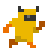
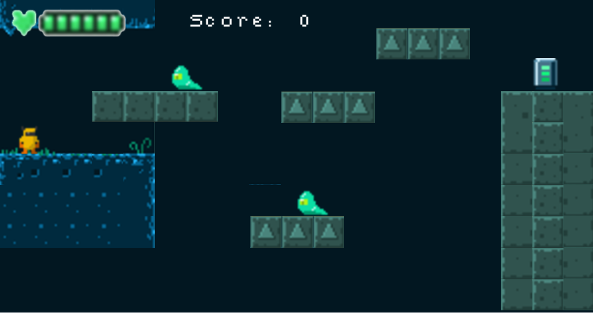
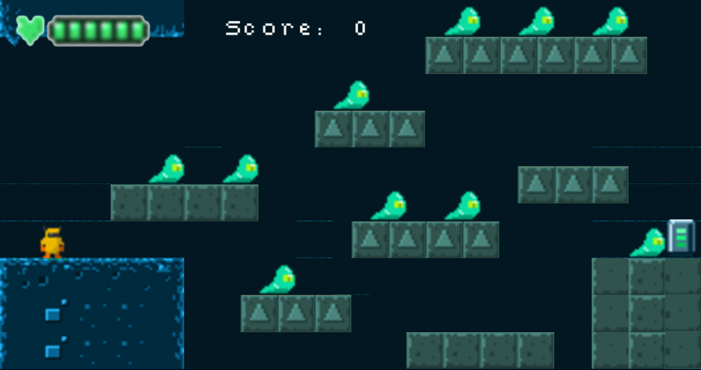
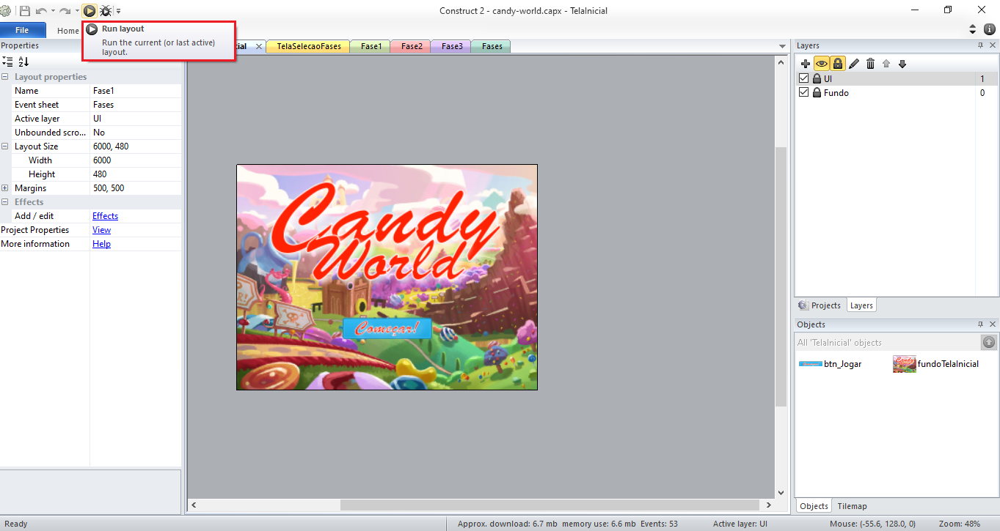
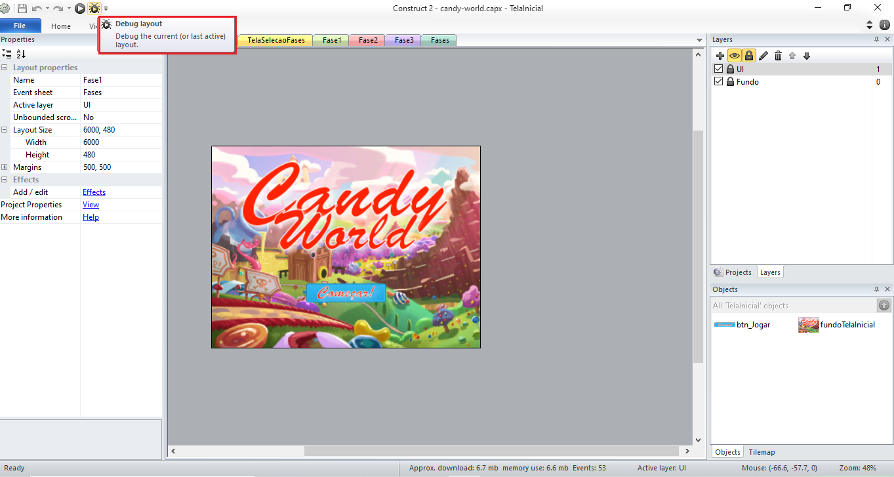

# Shooting platform

<br />
<p align="center">
  <a href="#">
    
  </a>

  <h3 align="center">Shooting platform</h3>

  <p align="center">
    Ajude nosso personagem a derrotar seus inimigos
    <br />
    <a href="https://github.com/lucas-castro-developer/shooting-platform"><strong>Explore as documentações »</strong></a>
    <br />
    <br />
  </p>
</p>

<details open="open">
  <summary>Conteúdos</summary>
  <ol>
    <li>
      <a href="#sobre-o-projeto">Sobre o projeto</a>
      <ul>
        <li><a href="#construído-com">Construído com</a></li>
      </ul>
    </li>
    <li>
      <a href="#iniciando">Iniciando</a>
      <ul>
        <li><a href="#pré-requisitos">Pré-requisitos</a></li>
        <li><a href="#instalação">Instalação</a></li>
      </ul>
    </li>
    <li><a href="#Contribuição">Contribuição</a></li>
    <li><a href="#Licença">Licença</a></li>
    <li><a href="#Contato">Contato</a></li>
  </ol>
</details>

## Sobre o projeto

Game desenvolvido no Módulo "Plataforma de Tiro" do curso "Aprenda a criar jogos com Construct 2".

No jogo, é necessário ajudar o boneco amarelo mascarado a capturar seus servidores

O aplicativo é composto de duas fases:

**Fase 1**



**Fase 2**



### Construído com

Este projeto foi construído com o auxílio da seguinte ferramenta
* [Construct 2](https://construct-2.br.uptodown.com/windows)

<!-- GETTING STARTED -->
## Iniciando

Para começar a manipular o projeto, siga os passos abaixo:

### Pré-requisitos

O único pré-requisito do projeto é ter o Construct 2 instalado localmente ou em sua versão portable.

### Instalação

1. Clone o repositório
 ```sh
 git clone https://github.com/lucas-castro-developer/shooting-platform.git
 ```

2. Clique duas vezes no arquivo `shooting-platform.capx`, na raiz do projeto, e o Construct 2 será aberto:

3. Para rodar o projeto, clique na botão `Run Layout`:



4. Caso queira rodar no modo debug, clique no botão `Debug Layout`:



Seu navegador de preferência será aberto e o jogo será iniciado pelo navegador, geralmente no endereço `http://localhost:50000/`. Mas isso pode variar dependendo da configuração da sua máquina e/ou do projeto.

## Contribuição

Quer contribuir com este projeto? Então siga os passos abaixo:

1. Realize o fork do projeto
2. Crie sua branch (`git checkout -b feature/AmazingFeature`)
3. Faça o commit das suas modificações/criações (`git commit -m 'Add some AmazingFeature'`)
4. Publique a branch (`git push origin feature/AmazingFeature`)
5. Abra uma Pull Request

## Licença

Este projeto não utiliza nenhum tipo de licença.

## Contato

Lucas dos Santos Castro - [LinkedIn](https://www.linkedin.com/in/lucas-santos-castro-developer/) - lucascastrodeveloper@gmail.com

Project Link: [https://github.com/lucas-castro-developer/shooting-platform](https://github.com/lucas-castro-developer/shooting-platform)
